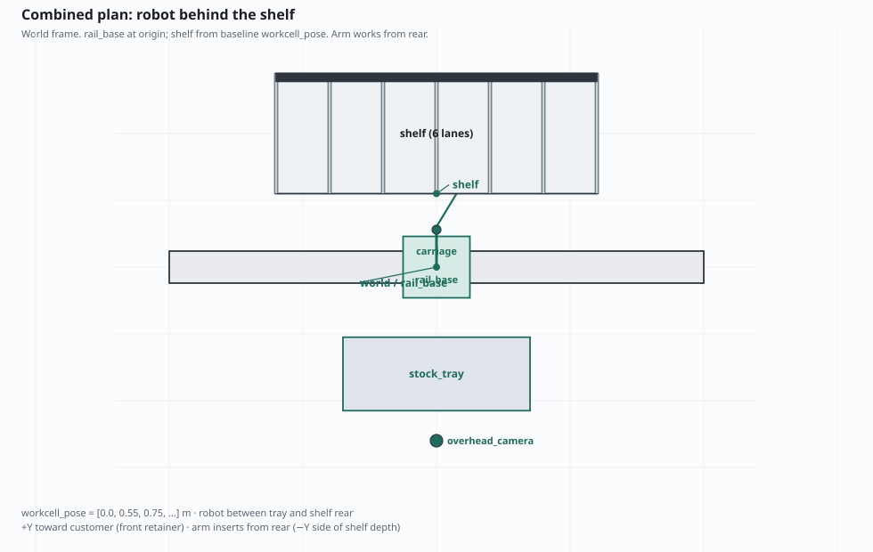

# Vision-guided beverage restocking

A simulation-first robotics project: a robot arm on a rail restocks cans and bottles into a
refrigerated shelf from the rear, the way a shop assistant refills a drinks cooler. It runs
entirely in simulation (Gazebo physics, ROS 2, MoveIt motion planning) and is vendor-neutral. The
aim is a small, readable reference for how to keep a robot's decisions checkable: the robot
chooses what to move and where, then verifies the result against the simulated world rather than
trusting its own report.

**[Documentation](https://kikijiki.github.io/combeanie/)**

The name: the robot works in a _combini_ and wears a _beanie_.

https://github.com/user-attachments/assets/a9c9a460-1c07-4206-865e-26fbeb600d7c

_The simulated workcell: a UR10e arm on a rail between the stock tray (left) and the shelf
(right)._

## What you can do with it

- **Watch the robot restock a shelf by itself.** `just demo` surveys the shelf lanes, works out
  which are below their target count, finds a matching product on the tray with the wrist camera,
  and moves it into a lane until every lane is full.
- **Run it on camera evidence.** Product positions and lane contents come from the arm's wrist
  camera by default; simulator ground truth is available only as a labelled opt-in
  (`just demo gt:=true`).
- **Ask for one transfer.** The `RestockProduct` ROS action moves one product; the autonomous loop
  is built on top of it.
- **Replay scenarios exactly.** Seeded product layouts are byte-for-byte reproducible, so a
  failure seen once can be reproduced.
- **Run acceptance tests and benchmarks.** Full-stack launch tests assert on world state, and a
  benchmark harness reports a failure taxonomy rather than a single pass/fail.
- **Explore the model.** The website has interactive 3D views of the robot and cell, and a manual
  covering each subsystem.

The shelf has six gravity-fed lanes (inclined roller beds, like a convenience-store drinks
cooler): the arm sets a product just inside the lane mouth and physics rolls it to the front.
Lanes are paired by product class (can, small bottle, large bottle), so there is always a
second compatible lane to choose from.

## How it works

Every motion goes through the same deterministic chain:

```text
task state machine
  -> world-state validation (what is really on the shelf and tray)
  -> grasp and placement candidates
  -> MoveIt planning and collision checking
  -> trajectory execution
  -> ros2_control
  -> Gazebo joints
```

Learned perception or reasoning models are optional add-ons. They cannot command joints or skip
planning and collision checks, and the system behaves identically without them.



_Plan view of the simulated workcell (generated from the surveyed geometry in the repository)._

## Quick start

Requirements: Linux, [Nix](https://nixos.org/) with flakes enabled, and (optionally)
[direnv](https://direnv.net/). No host ROS install is needed; the flake pins ROS 2 Jazzy, Gazebo
Harmonic and MoveIt 2. The demo opens a Gazebo window, so it needs a graphical session
(`DISPLAY` or `WAYLAND_DISPLAY`).

```bash
nix develop        # or: direnv allow
just doctor        # checks the environment
just build         # builds the ROS workspace under ros_ws/ (first build is long)
just demo          # autonomous restocking: Gazebo, MoveIt, RViz and the coordinator
```

Useful variations (`just help` lists every command):

```bash
just demo 3                 # stop after three cycles
just demo gt:=true          # labelled ground-truth demo on the larger dense tray
just launch-baseline        # the same workcell without the autonomous goal, to drive it yourself
just launch-baseline scenario_seed:=42   # replay a seeded scenario
just test-package restocker_bringup      # acceptance tests, headless (slow)
just benchmark baseline_transfers        # reliability benchmark; then `just benchmark-report`
```

Without a display, use the headless entry points (tests, benchmarks, `just planning-smoke`).

## Repository layout

| Path          | Contents                                                                                                                                                                                                    |
| ------------- | ----------------------------------------------------------------------------------------------------------------------------------------------------------------------------------------------------------- |
| `ros_ws/src/` | The ROS 2 packages: interfaces, description (robot and cell models), Gazebo simulation, control, perception, world state, planning, task execution, benchmarks, bringup (launch files and acceptance tests) |
| `website/`    | The Docusaurus manual, including interactive 3D views and the demo video                                                                                                                                    |
| `scripts/`    | Helpers behind the `just` commands (demo, doctor, workspace wrappers, repository checks)                                                                                                                    |
| `tools/`      | Diagnostics and generators for scenarios and product labels                                                                                                                                                 |
| `config/`     | Colcon and development defaults                                                                                                                                                                             |
| `justfile`    | Every supported command; run `just help`                                                                                                                                                                    |
| `flake.nix`   | The pinned toolchain and the `nix flake check` suite                                                                                                                                                        |

## Documentation

Build the manual with `nix develop .#docs --command just docs`, or browse the sources:

- [Introduction](https://kikijiki.github.io/combeanie/docs)
- [Run the demo](https://kikijiki.github.io/combeanie/docs/run/demo) and [setup](https://kikijiki.github.io/combeanie/docs/run)
- [Scenarios and launch arguments](https://kikijiki.github.io/combeanie/docs/run/scenarios)
- [Tests and benchmarks](https://kikijiki.github.io/combeanie/docs/run/tests-and-benchmarks)
- [Architecture](https://kikijiki.github.io/combeanie/docs/architecture) and [packages](https://kikijiki.github.io/combeanie/docs/reference/packages)
- [Fundamentals](https://kikijiki.github.io/combeanie/docs/fundamentals): ROS 2, Gazebo, MoveIt and TF explained for newcomers
- [FAQ](https://kikijiki.github.io/combeanie/docs/reference/faq)

## Contributing and license

See [CONTRIBUTING.md](CONTRIBUTING.md). Before opening a pull request, run `just format`,
`just lint`, `just test` and `just flake-check`.

Licensed under the MIT license; see [LICENSE](LICENSE). The UR10e visual meshes used by the website's
3D views are covered by their own notice in
[website/static/models/LICENSE-UR10e.md](website/static/models/LICENSE-UR10e.md).
